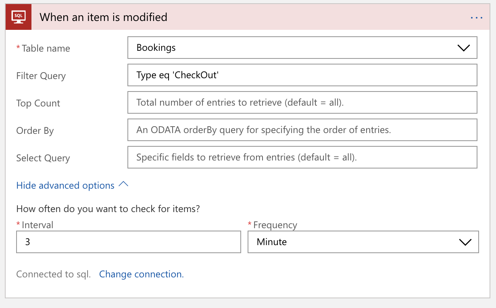

# SmartHotel360 - Application Modernization

This repository contains code used in the [demo presented during the Ignite 2018 Application Modernization](https://youtu.be/PSRQ-kg5mnQ?t=960) session. In this repository you'll find a pair of Visual Studio projects, an ASP.NET Web Forms application and a WCF Service project. 

# SmartHotel360 Repos
For this reference app scenario, we built several consumer and line-of-business apps and an Azure backend. You can find all SmartHotel360 repos in the following locations:

* [SmartHotel360 ](https://github.com/Microsoft/SmartHotel360)
* [IoT Demo](https://github.com/Microsoft/SmartHotel360-IoT)
* [Backend Services (optimized for Kubernetes)](https://github.com/Microsoft/SmartHotel360-AKS-DevSpaces-Demo)
* [Public Website](https://github.com/Microsoft/SmartHotel360-public-web)
* [Mobile Apps](https://github.com/Microsoft/SmartHotel360-mobile-desktop-apps)
* [Sentiment Analysis](https://github.com/Microsoft/SmartHotel360-Sentiment-Analysis-App)
* [Migrating Internal apps to Azure](https://github.com/Microsoft/SmartHotel360-internal-booking-apps)
* [Original Backend Services](https://github.com/Microsoft/SmartHotel360-Azure-backend)
* [Application Modernization](https://github.com/Microsoft/SmartHotel360-AppModernization)
* [How Containers Enable Local Development](https://github.com/microsoft/SmartHotel360-ContainersForLocalDev)

# Demo Setup

1. Create a new resource group in your Azure subscription called **Registrations**. 
1. Create an Azure SQL Database (and server if you don't already have one) in the Registrations resource group. 
1. Create 2 new App Services, called something like "RegistrationsWeb"
 and "RegistrationsWcf" so you can tell the two App Services apart. If you do not have an existing App Service Plan to use for these App Services, create a new one and use it for both of the App Services you create.
1. Edit the web.config file in the WCF service so that it reflects the correct SQL Connection string for the database you created. 
1. Edit the web.config file for the ASP.NET Web App so that it points to the App Service you created to house the WCF Service. 
1. Publish the WCF service to App Service using Visual Studio. 
1. Publish the ASP.NET app to App Service using Visual Studio. 
1. Verify that the ASP.NET App is displaying data properly. 
1. Create a new Logic App named **CheckInLogicApp** (or something similar). 
1. Start with a blank template. 
1. Type **SQL** in the search box to find the SQL-related actions. Then, select SQL Server from the list, and **When an item is modified** from the second box. 

    

1. Provide the username and password and select the RegistrationDb database.

    

1. Select the **Bookings** table from the list of tables to watch. 

    

1. Expand the Advanced options and provide the query `Type eq 'CheckOut'`. 

    

1. Craft a welcoming "check-in" message, with HTML tags to format it well, and use some of the fields like `CustomerName` from the pick-list. Then, select **Enter custom value** for the **Target Language** field. 

    

1. Select `Culture` from the pick-list and English for the **Source language** field. 

    

1. Add a new **initialize variable** step to the Logic App named **subject**, and set the default value of the subject variable to be an English-language welcome message. 

    

1. Add another translator step, and translate the subject variable to the same target language. 

    

1. Add a new **set variable** action, and set the value of the subject variable to be the translated subject string from the **translate text 2** action. 

    

1. Search for **email** and select the Office365 --> Send an email action. 

    

1. Login to your Office365 account, give the Logic App access to send emails, and then use the subject variable and the translated text from your **first** translator action. Provide your own email address (so you can show the incoming emails on-screen during the demo). 

    

1. Finally, clone the check-in Logic App into a new Logic App named **CheckOutLogicApp**, and tweak the subject and email text so that they're more specific to checking **out** than with checking **in**. 

1. For the last step, change the query for the CheckOutLogicApp to be `Type eq 'CheckIn'`. This way, the second Logic App will only execute when the table is updated in reverse. 

# The Scenario

This demo is based on SmartHotel360, which is a fictitious smart hospitality company. Due to the complexity of managing the local infrastructure, SmartHotel360 wants to re-host their web app (along with the WCF Service and SQL database) and add extended functionality to send localized emails without changing their production code. 

Azure makes it easy to modernize your application portfolio. With Azure App Service, you can easily migrate your existing .NET applications along with WCF services that use HttpBinding with very minimal effort. And add serverless functionality to approach a Cloud Native solution. In this demo, we will show you how you can bring a ASP.NET Web.Forms based application to Azure App Service along with a SQL database to Azure SQL. We’ll also add on additional functionality by using Logic App and Cognitives Services.  

# Demo Steps

The SmartHotel360 Registration App consists of two projects, an ASP.NET Web Forms application from some time ago, and a WCF Service we built to provide a Web Service API to access a SQL Server database. 

We’ve already migrated the SQL database into Azure SQL Databases, so I’ve created my own development area to see if my legacy ASP.NET Framework (not Core or Standard, your old friends ASP.NET Web Forms and WCF) will work okay in Azure App Service. 

I’m going to deploy the WCF service into Azure App Service using the simple publishing tools in Visual Studio. 

Wait for the WCF Service to be published to Azure. When it is published the URL should open for the service file (or the directory view, which will enable you to click the WCF Service file).

The ASP.NET application is a simple CRUD app, the kind of app you’ve probably built over and over again with ASP.NET Web Forms. 

It allows hotel staff to toggle when guests check into or out of the hotel. Use the **Check In** and/or **Check Out** buttons to toggle the status of one or two of the customers. 

In Azure we have the App services for the Web and WCF and the SQL Azure for the database. Those are resources that house code and data we migrated. 

With cloud-native app dev opportunities you can extend your existing applications – without needing to crack open the code. 

SmartHotel360 wanted to make guests feel welcome and appreciated but no not too many of the newer devs understand the registration app or wanted to sign on to maintain it.

With Logic Apps, the app could be extended without code. We simply watch for SQL updates to the Bookings table when customers are checked in…

... we send an email to the guest to welcome them to the hotel. 

Click the Overview link to go back to the main page of the Logic App. Click the **Enable** button if the Logic App is disabled. 

Flip back to the ASP.NET app’s tab in the browser. Click the Check In link for a customer who has English in their language column. 

Flip to the browser with Outlook open. There should be a new email.

Flip back to the browser tab with the Check-in Logic App and click the Edit button.

Expand the **Translate Text** step. 

Switch over to the tab with the ASP.NET Web Forms app and check in or out some of the non-English speaking customers. 

Flip back to the browser with Outlook open. 

Flip to the check-in Logic App in the Azure portal. Click the **Clone** button in the toolbar. 

GIve the logic app a new name, and make sure to **disable** it. We'll enable the Logic App later once we get it the way we want it to be. 

Once the Logic App is finished provisioning, click the **Go to Resource** button. 

Click the **Edit** button to go into the Logic Apps Designer. 

Delete the **Send an email** step. 

Delete the first **Translate text** step, as it was feeding data to the **Send an email** step we just deleted, so we don't need it any more. 

Edit the text of the **subject** variable in the Logic App to shorten it and make it more like a short message one would receive via SMS. Add in the Customer ID as a coupon code. 

Click the **New Step** button at the bottom.

Type **SMS** into the search box. 

> Note: This next step presumes you have a Twilio account set up that you can use to send SMS messages. Any of the SMS providers would be great here, we just used Twilio since we had a previously-setup account. 

Select Twilio from the list of providers. 

Select the **Send Text Message (SMS)** action. 

Select the "from" phone number (this is provided by Twilio or whichever provider you selected).

Drop the **PhoneNumber** column from the database field list into the **To Phone Number** field in the designer. 

Then, drop the **subject** variable into the **Text** field of the SMS step. 

Save the changes you've made. 

Go back to the Overview page by clicking the Logic App's name in the toolbar. 

Enable the Logic App.

Flip to the ASP.NET Web Forms app and check in a customer. 

Note that within seconds you will receive a text message containing the translated text. 

# Contributing

This project welcomes contributions and suggestions.  Most contributions require you to agree to a
Contributor License Agreement (CLA) declaring that you have the right to, and actually do, grant us
the rights to use your contribution. For details, visit https://cla.microsoft.com.

When you submit a pull request, a CLA-bot will automatically determine whether you need to provide
a CLA and decorate the PR appropriately (e.g., label, comment). Simply follow the instructions
provided by the bot. You will only need to do this once across all repos using our CLA.

This project has adopted the [Microsoft Open Source Code of Conduct](https://opensource.microsoft.com/codeofconduct/).
For more information see the [Code of Conduct FAQ](https://opensource.microsoft.com/codeofconduct/faq/) or
contact [opencode@microsoft.com](mailto:opencode@microsoft.com) with any additional questions or comments.
